---
jupyter:
  kernelspec:
    display_name: Python 3 (ipykernel)
    language: python
    name: python3
  language_info:
    codemirror_mode:
      name: ipython
      version: 3
    file_extension: .py
    mimetype: text/x-python
    name: python
    nbconvert_exporter: python
    pygments_lexer: ipython3
    version: 3.9.13
  nbformat: 4
  nbformat_minor: 4
---

# Projekt \"Kamień, Papier, Nożyce\"

# Podstawy Reprezentacji i Analizy Danych

# 18.01.2023

**Członkowie zespołu: Cybulski Dawid, Petrashevich Ulyana, Sekula
Sebastian**

Projekt polega na stworzeniu algorytmu rozpoznającego gesty w grze
\"Kamień, Papier, Nożyce\"(\"Rock, Paper, Scissors\").

Dane wykorzystane do wytrenowania modelu:
<https://www.kaggle.com/datasets/drgfreeman/rockpaperscissors?datasetId=107582&sortBy=voteCount>.

Do dyspozycji zbiór 2 188 obrazów kolorowych, w tym 712 z gestem
\"Papier\", 726 z gestem \"Kamień\", 750 z gestem \"Nożyce\". Rozmiar
obrazów: 300x200 pikseli.

Podjęliśmy decyzję, aby rozwiązać zadanie poprzez model uczenia sieci
neuronowych, ponieważ:

1.  Sieć może być wykorzystana dla innych danych z podziałem na 3 klasy.
2.  Nie musimy przeprowadzać analizy, model sam wyznacza części
    charakterystyczne.
3.  Wyszkolony na dobrych danych jest bardziej odporny na przypadki
    \"niejednoznaczne\", np. ręka nie jest widoczna w całości.
4.  Mamy dostęp do dużej ilości materiałów pomocniczych.
5.  Sztuczna inteligencja jest popularna we współczesnym świecie.

## Implementacja

Wgranie potrzebnych bibliotek

```python
import tensorflow as tf
import matplotlib.pyplot as plt
import matplotlib.image as mpimg
from tensorflow.keras.preprocessing.image import ImageDataGenerator
from tensorflow.keras.utils import to_categorical

import os
PATH = os.getcwd()
```

W tym momencie zaczyna się wczytywanie i dodatkowa modyfikacja danych
wejściowych, aby otrzymać dane, które w sposób najkorzystniejszy (to
jest przy niedługim czasie, a przy dobrej jakości) pozwolą nam
wytrenować model rozpoznawania obrazów.

Mamy możliwość swoimi oczami przeanalizować dostępne obrazy w folderze.
Dlatego wiemy, że większość obrazów mają jednakową postać: ręka jest w
środku, dobrze widoczna, prosto do kamery. Ale na niektórych obrazach
ręka jest ucięta albo obrócona. Taki zestaw jest dobry dla trenowania,
bo nauczy model poprawnie rozpoznawać nie tylko absolutnie przejrzyste
przypadki.

Lecz załóżmy, że dane mogą się zmienić i \"nietypowych\" obrazków już
nie będzie albo nie możemy sprawdzić, czy są. ImageDataGenerator przy
wczytaniu losowo wybiera obrazy i przekształca je - zmienia perspektywę,
przybliża, odbija, przesuwa i t.p. - znaczy generuje nam właśnie
przypadki \"nietypowe\".

train_data - instancja generatora obrazów z konkretnymi parametrami
(odpowiada za późniejszą obróbkę obrazów). Wartości parametrów zostały
podane zgodnie z przykładem na
stronie(<https://www.tensorflow.org/api_docs/python/tf/keras/preprocessing/image/ImageDataGenerator>):
nie duże i nie małe:

1.  **rescale** - po zakończeniu wszystkich przekształceń pomnaża dane
    przez podaną wartość.
2.  **rotation_range** - zakres stopni obrotu losowo wybranego obrazu.
3.  **width_shift_range** - zakres przesunięcia poziomowego(w naszym
    przypadku mierzony w częściach szerokości obrazu) losowo wybranego
    obrazu.
4.  **height_shift_range** - zakres przesunięcia pionowego(w częściach
    wysokości obrazu) losowo wybranego obrazu.
5.  **shear_range** - kąt zmiany perspektywy(w stopniach, w ruchu
    przeciwnym do wskazówek zegara) losowo wybranego obrazu. Przykład
    zmiany perspektywy:


Źródło:
https://en.wikipedia.org/wiki/Shear_force

1.  **zoom_range** - zakres przybliżenia(\[1-0.2, 1+0.2\]) losowo
    wybranego obrazu.
2.  **horizontal_flip** - dodaje możliwość poziomego lustrzanego odbicia
    losowego obrazu.
3.  **fill_mode=\'nearest\'** - przy niektórych z przekształceń w
    obrazie znajdą się dane bez wartości(np. przesunięcie, zmiana
    perspektywy), dla takich danych przypiszemy wartości komórek
    znajdujących się najbliżej.
4.  **validation_split**- część obrazów, która będzie zarezerwowana jako
    dane dla sprawdzenia modelu. W naszym przypadku część walidacyjna
    stanowi 20% wszystkich obrazów. Nie jest to za mało co pomoże dobrze
    określić poprawność działania modelu, ale też nie jest to za duża
    ilość co nie ograniczy zdolności poznawczych w trakcie nauki.

train_generator - przy podanej ścieżce do folderu z danymi, pozyskuje je
tworząc \"batche\" (to jest grupy obrazów), które będą wykorzystane do
wytrenowania modelu.

1.  **directory** - ścieżka do folderu z odpowiednio oznaczonymi
    obrazami.

2.  **class_mode** - argument w swojej domyślnej formie zawierający
    wartość \"categorical\" odpowiada to za prawidłowe rozpozanie
    danych - gdzie dane są poprawnie opisane - już mają swoje etykiety
    (w naszym przypadku są w odpowiednio nazywanych folderach.

3.  **batch_size** - jeśli mówimy o tworzeniu grup obrazów, to można też
    określić wielkość tych grup i właśnie za to odpowiada owy argument
    (domyślnie ma wielkość 32).

4.  **target_size** - jest to rozmiar, do jakiego będzie sprowadzane
    wczytane kolejno obrazy.

5.  **subset=\'training\'** - wczytuje odpowiednio wcześniej oznaczone
    dane do treningu.

validation_data - jest instancją generatora obrazów, tym razem z
mniejszą ilością parametrów. Jest to potrzebne po to, aby pozyskiwać
obrazy w niezmienionej formie, albowiem model będzie rozpoznawał
oryginalne obrazy, a nie wstępnie przetworzone - mogłoby to się odbić na
poprawności wytrenowanego modelu.

validation_generator - pozyskuje obrazy tworząc \"batche\", które będą
wykorzystane do sprawdzenia poprawności działania modelu.

1.  **subset=\'validation\'** - wczytuje odpowiednio wcześniej oznaczone
    dane do walidacji.

```python
main_dir = "rps-cv-images"
train_data = ImageDataGenerator( rescale = 1.0/255,
                                          rotation_range=20,
                                          width_shift_range=0.2,
                                          height_shift_range=0.2,
                                          shear_range=0.2,
                                          zoom_range=0.2,
                                          horizontal_flip=True,
                                          fill_mode='nearest',
                                           validation_split=0.2
                                  )


train_generator = train_data.flow_from_directory(main_dir,
                                                    target_size=(60, 40),
                                                   subset='training')

validation_data = ImageDataGenerator(rescale = 1.0/255,
                                        validation_split=0.2)


validation_generator = validation_data.flow_from_directory(main_dir,
                                                    target_size=(60, 40),
                                                    subset='validation')
```

## Teraz zaczyna się tworzenie splecionej sieci neuronowej.

### Opis działania modelu

Spleciona sieć neuronowa(CNN) działa podobnie do mózgu człowieka -
rozpoznaje obiekty na obrazie poprzez rozpoznanie części i relacji
pomiędzy nimi.

1.  Część obrazu o rozmiarach, równych rozmiarom filtru, porównuje się z
    filtrem poprzez sumowanie mnożeń wartości piksela w części obrazu o
    wartość piksela w filtrze na tym samym miejscu. Dodając stałą \"bias
    term\", odpowiadający za przesunięcie krzywej do prawej lub strony,
    otrzymujemy wynik, który umieszczamy w nowej warstwie. Dalej robimy
    to samo, ale przesuwamy część obrazu o 1 krok (zazwyczaj 1 piksel).

        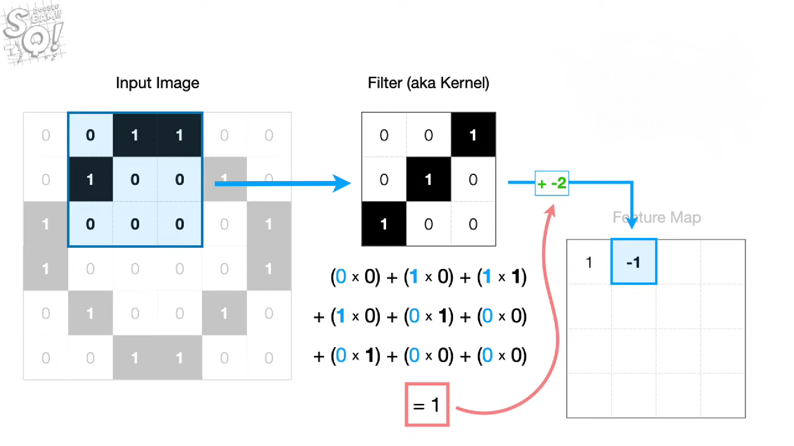

        Źródło:

    <https://youtu.be/HGwBXDKFk9I>

1.  Otrzymaną warstwę przetwarzamy za pomocą funkcji relu. Ona zapewni,
    że wszystkie ujemne wartości staną się zerami, dodatnie pozostaną
    niezmienione.
    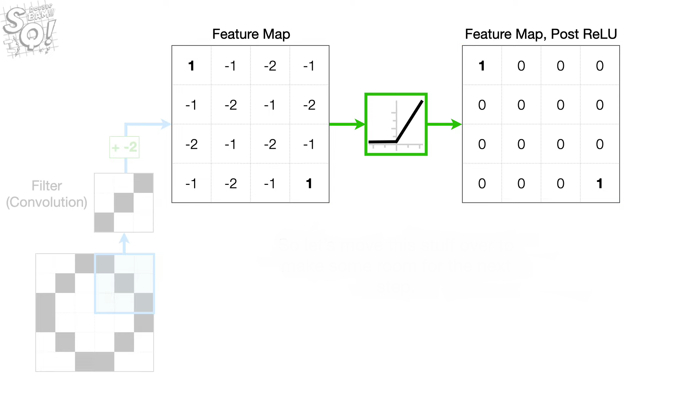
    Źródło:
    <https://youtu.be/HGwBXDKFk9I>

1.  Za pomocą nowego filtra (MaxPooling) wyciągamy z oddzielnych części
    (zwyczajnie o rozmiarach 2x2) warstwy wartości maksymalne i
    umieszczamy w nowej warstwie. To skutkuje odnalezieniem części
    obrazów, w których filtr był najbardziej podobny do obrazu.
    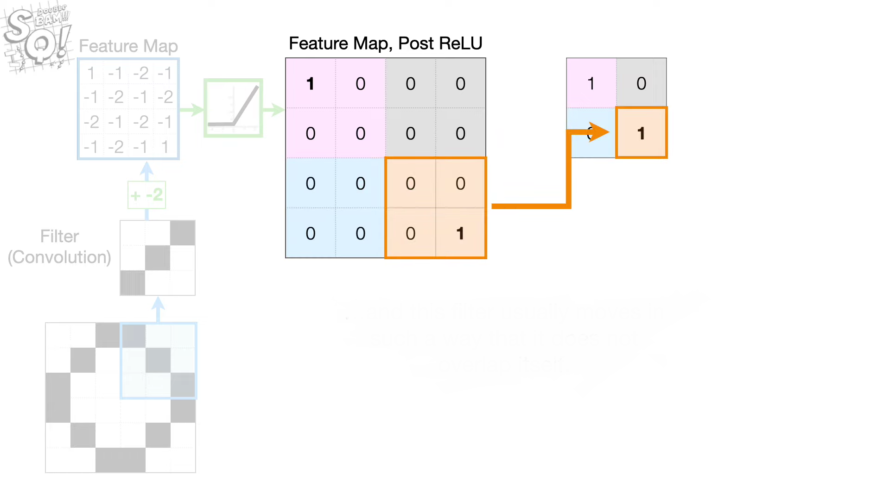Źródło:
    <https://youtu.be/HGwBXDKFk9I>

1.  Spłaszczamy warstwę, otrzymując jednowymiarowy wektor. Warstwa Dense
    (albo warstwa gęsta) łączy wszystkie swoje neurony z każdą wartością
    w wektorze. Każde takie połączenie ma swoją wagę. Pomnażając wartość
    w wektorze o wagę połączenia, sumując wyniki i dodając wartość bias
    otrzymujemy wynik odpowiadający poziomowi aktywacji neuronu. Funkcja
    softmax pozwoli na doprowadzenie wartości do postaci, gdzie je summa
    jest równa 1, pozwalając traktować wartości jako prawdopodobieństwo
    przynależności obrazu do kategorii.

    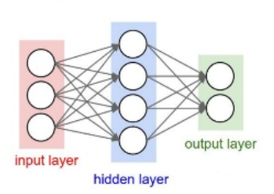

    Źródło: https://www.databricks.com/glossary/dense-tensor

    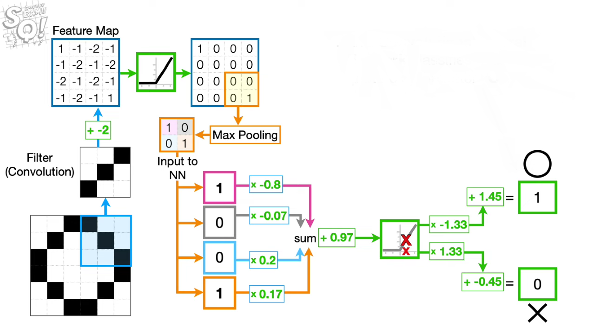Źródło:
    <https://youtu.be/HGwBXDKFk9I>

W trakcie trenowania modelu neurony dobierają względem siebie lepsze
wagi, aby lepiej rozpoznawać obraz.

### Tworzenie modelu

```python
from tensorflow.keras.layers import Conv2D, BatchNormalization, MaxPooling2D, Flatten, Dense
from tensorflow.nn import relu, softmax
```

Teraz tworzony jest model \"Sekwencyjny\" - jest to typ modelu, który
opiera się o kolejno tworzone warstwy, które w odpowiedni sposób
przetwarzają obraz, aby ostatecznie go rozpoznać.

W naszym przypadku model składa się z warstw:

1.  **Conv2D** - warstwa odpowiedzialna za wyznaczenie filtrów i
    sprawdzenie ich dopasowań w całym obrazie.

    1.  Pierwszym argumentem jest liczba filtrów, które będą porównywane
        z częściami obrazu.
    2.  Rozmiar filtra.
    3.  _activation=relu_ - jest to funkcja, która powstałe w macierzy
        ujemne wyniki zmienia na 0.
    4.  _input_shape=(60, 40, 3)_ - argument określający rozmiar obrazów
        przyjmowanych przez warstwę.
    5.  _padding=\'same\'_ - dodanie tego parametru uzupełnia macierz
        wejściową zerami na brzegach w taki sposób, aby po nałożeniu na
        nią filtra, rozmiar macierzy wyjściowej był taki sam jak
        oryginalny rozmiar macierzy wejściowej (podczas nakładania
        filtra na macierz tracona jest część informacji, dodawanie zer
        pozwala tego uniknąć).
        (<https://www.youtube.com/watch?v=PGBop7Ka9AU>)

2.  **BatchNormalization** - zawęża gamę wejściowych liczb do przedziału
    \<0,1\>. Poprawia późniejsze określanie wag neuronów.
    (<https://www.youtube.com/watch?v=yXOMHOpbon8>),

3.  **MaxPooling2D** - warstwa pozyskująca największe wartości z grup
    elementów wcześniej powstałej macierzy.

4.  **Flatten** - warstwa w oparciu o powstałą macierz tworząca
    jednowymiarowy wektor.

5.  **Dense** - warstwa odpowiedzialna za prawidłowe określanie ważności
    cech poszczególnych komórek wcześniej powstałej tablicy w celu
    poprawnej kategoryzacji wczytywanych obiektów.

    1.  Pierwszy argument jest długością zwracanej tablicy.
    2.  _activation=softmax_ - funkcja sprawiająca, że zwracane wartości
        sumują się do liczby 1. Dzięki temu możemy owe wartości
        traktować jako prawdopodobieństwo.

```python
model = tf.keras.models.Sequential([
    Conv2D(64, (5,5), activation=relu,input_shape=(60, 40, 3), padding = 'same'),
    BatchNormalization(),

    Conv2D(64, (3,3), activation=relu,padding = 'same'),
    MaxPooling2D(2,2),

    Conv2D(128, (3,3), activation=relu,padding = 'same'),
    MaxPooling2D(2,2),

    Flatten(),

    Dense(256, activation=relu),
    Dense(3, activation =softmax)
])

model.summary()
```

    Model: "sequential_1"
    **************\*\*\*\***************\_**************\*\*\*\***************
    Layer (type) Output Shape Param #
     =================================================================
    conv2d_3 (Conv2D) (None, 60, 40, 64) 4864

     batch_normalization_1 (Batc  (None, 60, 40, 64)       256
     hNormalization)

     conv2d_4 (Conv2D)           (None, 60, 40, 64)        36928

     max_pooling2d_2 (MaxPooling  (None, 30, 20, 64)       0
     2D)

     conv2d_5 (Conv2D)           (None, 30, 20, 128)       73856

     max_pooling2d_3 (MaxPooling  (None, 15, 10, 128)      0
     2D)

     flatten_1 (Flatten)         (None, 19200)             0

     dense_2 (Dense)             (None, 256)               4915456

     dense_3 (Dense)             (None, 3)                 771

    =================================================================
    Total params: 5,032,131
    Trainable params: 5,032,003
    Non-trainable params: 128
    _________________________________________________________________

Aby model nie był zbyt dokładny - rozpoznawał prawidłowo reguły, a nie
same obrazy na których był ćwiczony - musimy zmniejszyć tempo uczenia
naszego modelu.

```python
from keras.callbacks import ReduceLROnPlateau
```

Funkcja ReduceLROnPlateau jest rozwiązaniem naszego problemu \"zbyt
dopasowanego modelu\"
(<https://keras.io/api/callbacks/reduce_lr_on_plateau/>). Parametry:

1.  **monitor=\'val_acc\'** - ten argument mówi o tym, że w momencie,
    kiedy metryka poprawności rozpoznawania danych wejściowych nie
    poprawia się, zmniejszane jest tempo uczenia.

2.  **patience=2** - ilość epok, które muszą przejść, aby redukcja tempa
    uczenia zaczęła być wprowadzana w życie.

3.  **verbose=1** - każdy raz przy uruchomieniu zmniejszania tempa
    będzie wyświetlany odpowiedni komunikat.

4.  **factor=0.5** - współczynnik określający zmianę tempa uczenia
    (nowe_tempo = factor \* stare_tempo).

5.  **min_lr=0.000003** - dolny limit tempa uczenia - wolniej nie
    będzie.

```python
learning_rate_reduction = ReduceLROnPlateau(monitor='val_accuracy',
                                            patience=2,
                                            verbose=1,
                                            factor=0.5,
                                            min_lr=0.000003)
```

W tym momencie możemy już się podjąć uczenia naszego modelu.

Metoda \"compile\" rozpoczyna owy proces. Parametry:

1.  **loss**=\'categorical_crossentropy\' - funkcja straty - owa funkcja
    w oparciu o przewidywaną kategorię dla danego obrazi i obecny wynik
    kategoryzacji określa jak bardzo dobrze model klasyfikuje obiekty.
    Im mniejsza wartość owej funkcji, tym model działa lepiej. Jest to
    miara odchylenia od oczekiwanej wartości.
    \'categorical_crossentropy\' jest typem funkcji wykorzystywanym w
    procesie obliczania funkcji straty dla modeli, których zadaniem jest
    określanie kategorii obiektów. Etykiety powstałe w wyniku działania
    tejże modelu opartym o ową funkcję są zerami lub jedynką, w jasny
    sposób określając kategorię danego obrazu.
    (<https://gombru.github.io/2018/05/23/cross_entropy_loss/>)

2.  **optimizer=Adam()** - funkcja optymalizująca model w oparciu o
    funkcję straty, w sposób taki, aby ta funkcja była jak najmniejsza.
    Dlaczego Adam? Przez swoją złożoność obliczeniową i małe wymagania
    pamięciowe jest idealny do pracy ze zbiorami danych o dużej ilości
    parametrów. (<https://www.youtube.com/watch?v=JhQqquVeCE0>)

3.  **metrics=\[\'accuracy\'\]** - parametr na podstawie którego model
    będzie się uczył.

Metoda \"fit\" - trenuje zadany model.

1.  Pierwszym argumentem jest zbiór danych testowych.

2.  **epochs=15**, oznacza liczbę epok, potrzebnych do wytrenowania
    modelu.

3.  **verbose=1**, pokazuje informacje o postępach treningu.

4.  **validation_data** - zbiór danych walidacyjnych.

5.  **callbacks=\[learning_rate_reduction\]** - argument określający,
    funkcje do których odwołuje się model w trakcie uczenia. W naszym
    przypadku do funkcji zapobiegającej przetrenowaniu modelu.

_W kodzie inspiracyjnym pominięty był atrybut padding=\'same\' w
pierwszej warstwie m modelu co wpływało na pojawienie się błędu o braku
pozwolenia na optymalizację poprzez rozszerzenie macierzy o atrybut
padding, pozyskanych dalej macierzy przez warstwę Conv2D
(zmodyfikowanych przez parametr padding)_

```python
model.compile(loss = 'categorical_crossentropy', optimizer= tf.keras.optimizers.Adam(), metrics=['accuracy'])

history = model.fit(train_generator,
                    epochs = 15,
                    verbose = 1,
                   validation_data = validation_generator,
                   callbacks=[learning_rate_reduction])
```

Epoch 1/15
55/55 [==============================] - 27s 475ms/step - loss: 1.3192 - accuracy: 0.4654 - val_loss: 1.0087 - val_accuracy: 0.4485 - lr: 0.0010
Epoch 2/15
55/55 [==============================] - 26s 462ms/step - loss: 0.6222 - accuracy: 0.7470 - val_loss: 0.8354 - val_accuracy: 0.7368 - lr: 0.0010
Epoch 3/15
55/55 [==============================] - 27s 483ms/step - loss: 0.4657 - accuracy: 0.8332 - val_loss: 0.5975 - val_accuracy: 0.9474 - lr: 0.0010
Epoch 4/15
55/55 [==============================] - 24s 430ms/step - loss: 0.3311 - accuracy: 0.8789 - val_loss: 0.5643 - val_accuracy: 0.9565 - lr: 0.0010
Epoch 5/15
55/55 [==============================] - 23s 409ms/step - loss: 0.2539 - accuracy: 0.9086 - val_loss: 0.2693 - val_accuracy: 0.9725 - lr: 0.0010
Epoch 6/15
55/55 [==============================] - 22s 406ms/step - loss: 0.2351 - accuracy: 0.9126 - val_loss: 0.2686 - val_accuracy: 0.9588 - lr: 0.0010
Epoch 7/15
55/55 [==============================] - ETA: 0s - loss: 0.2476 - accuracy: 0.9172
Epoch 7: ReduceLROnPlateau reducing learning rate to 0.0005000000237487257.
55/55 [==============================] - 22s 407ms/step - loss: 0.2476 - accuracy: 0.9172 - val_loss: 0.2805 - val_accuracy: 0.9565 - lr: 0.0010
Epoch 8/15
55/55 [==============================] - 22s 405ms/step - loss: 0.1558 - accuracy: 0.9463 - val_loss: 0.1178 - val_accuracy: 0.9748 - lr: 5.0000e-04
Epoch 9/15
55/55 [==============================] - 23s 409ms/step - loss: 0.1315 - accuracy: 0.9577 - val_loss: 0.0896 - val_accuracy: 0.9840 - lr: 5.0000e-04
Epoch 10/15
55/55 [==============================] - 22s 406ms/step - loss: 0.0869 - accuracy: 0.9743 - val_loss: 0.0288 - val_accuracy: 0.9908 - lr: 5.0000e-04
Epoch 11/15
55/55 [==============================] - 22s 406ms/step - loss: 0.0853 - accuracy: 0.9720 - val_loss: 0.0323 - val_accuracy: 0.9863 - lr: 5.0000e-04
Epoch 12/15
55/55 [==============================] - ETA: 0s - loss: 0.0851 - accuracy: 0.9732
Epoch 12: ReduceLROnPlateau reducing learning rate to 0.0002500000118743628.
55/55 [==============================] - 23s 408ms/step - loss: 0.0851 - accuracy: 0.9732 - val_loss: 0.0403 - val_accuracy: 0.9908 - lr: 5.0000e-04
Epoch 13/15
55/55 [==============================] - 22s 407ms/step - loss: 0.0515 - accuracy: 0.9829 - val_loss: 0.0196 - val_accuracy: 0.9931 - lr: 2.5000e-04
Epoch 14/15
55/55 [==============================] - 22s 406ms/step - loss: 0.0594 - accuracy: 0.9760 - val_loss: 0.0166 - val_accuracy: 0.9931 - lr: 2.5000e-04
Epoch 15/15
55/55 [==============================] - 24s 439ms/step - loss: 0.0928 - accuracy: 0.9692 - val_loss: 0.0132 - val_accuracy: 0.9977 - lr: 2.5000e-04

## Wyniki działania modelu

```python
%matplotlib inline
acc = history.history['accuracy']
val_acc = history.history['val_accuracy']
loss = history.history['loss']
val_loss = history.history['val_loss']

epochs = range(len(acc))

plt.plot(epochs, acc, 'r', label='Training accuracy')
plt.plot(epochs, val_acc, 'b', label='Validation accuracy')
plt.title('Training and validation accuracy')
plt.legend()
plt.figure()

plt.plot(epochs, loss, 'r', label='Training Loss')
plt.plot(epochs, val_loss, 'b', label='Validation Loss')
plt.title('Training and validation loss')
plt.legend()

plt.show()
```

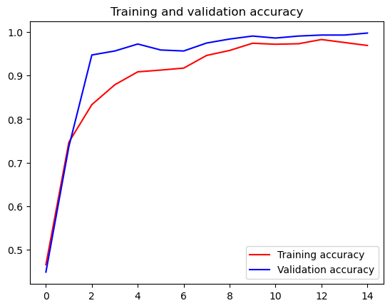

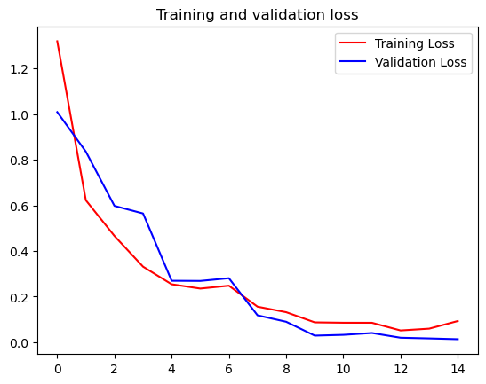

```python
import matplotlib.pyplot as plt
from sklearn import metrics
from sklearn.metrics import confusion_matrix, classification_report
```

```python
test_data = ImageDataGenerator(rescale = 1.0/255)
test_generator = test_data.flow_from_directory(main_dir,
                                                    target_size=(60, 40),
                                                   shuffle = False)

probs = model.predict(test_generator)
preds = probs.argmax(axis = -1)
y_test = test_generator.labels

accuracy = metrics.accuracy_score(y_test, preds)
print("Dokładność systemu: %.2f procent" % (accuracy*100))

cm = confusion_matrix(y_test,preds)
cm_display = metrics.ConfusionMatrixDisplay(confusion_matrix = cm, display_labels = ["Paper", "Rock", "Scissors"])
cm_norm =confusion_matrix(y_test,preds, normalize='pred')
cm_norm_display = metrics.ConfusionMatrixDisplay(confusion_matrix = cm_norm, display_labels = ["Paper", "Rock", "Scissors"])

cm_display.plot()
cm_norm_display.plot()
plt.show()
```

Found 2188 images belonging to 3 classes.
69/69 [==============================] - 7s 95ms/step
Dokładność systemu: 99.82 procent

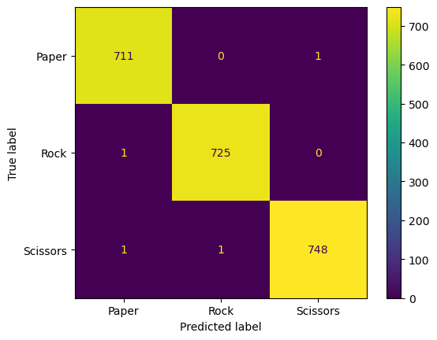

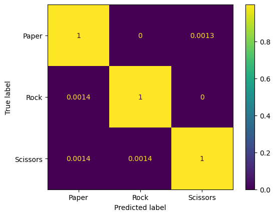

## Wnioski

> Jak możemy zaobserwować na powyższych wykresach, nasz model po
> wytrenowaniu osiąga niemalże stuprocentową skuteczność co jest bardzo
> zadowalającym wynikiem.

> Z macierzy konfuzji nie wynikają wielkie wnioski, bo błędne
> kategoryzowanie przez model sprowadza się do nikłej ilości przypadków,
> co może być wynikiem różnego typu czynników jak np. podobieństwa
> obrazów wynikającego ze zbyt dużego przeskalowania ich na wejściu, czy
> też po prostu niedostatecznego wyuczenia modelu.

## Dlaczego taka budowa modelu, a nie inna?

1.  Pozbycie się drugiej warstwy Conv2D znacząco obniża umiejętności
    klasyfikacyjne obrazów nie należących do zbioru testowego (filtry
    nie zostały udoskonalone)
2.  Nie używanie funkcji batch normalization obniża późniejsze
    umiejętności uczenia się modelu. Sam wykres również nam to obrazuje
3.  Usunięcie paddingów sprawia, że model w trakcie nauki, traci część
    danych przy każdej filtracji (tworzeniu mapy cech). W wyniku tego
    model przy mniejszej liczbe epok uczyłby się zdecydowanie słabiej.
4.  Zmniejszenie neuronów warstwy Dense znacząco ogarnicza umiejętności
    kategoryzacji obiektów.
5.  Zwiększenie neuronów nie wpływa znacząco na jakość klasyfikacji
    modelu. Może conajwyżej troszkę go osłabić ze względu na mniejszą
    generalizację pewnych zależności.

```python
import numpy as np
from PIL import Image
```

```python
#Funkcje używane do wyświetlania obrazów
def pliob(listaobr, ile_k = 1, listatyt = [], wart_dpi = 100, osie = False):
    # wyswietla liste obrazow kolorowych lub s skali szarosci
    rozm_obr = 5
    ile = len(listaobr)
    if len(listatyt) == 0:
        listatyt = [' ']*ile
    ile_w = np.ceil(ile / ile_k).astype(int)
    figsize_k = rozm_obr*ile_k
    figsize_w = rozm_obr*ile_w
    plt.figure(figsize=(figsize_k,figsize_w), dpi = wart_dpi)
    for i in range(0,ile):
        if isinstance(listaobr[i],np.ndarray):
            plt.subplot(ile_w,ile_k,i+1)
            pokaz(listaobr[i], listatyt[i], osie)
    plt.show()

def pokaz(im, tytul = "", osie = False):
    if not(osie):
        plt.axis("off")
    plt.imshow(im)
    plt.title(tytul)
```

```python
models_dir = PATH + "/data/model"
model_obecny = mpimg.imread(models_dir + "_obecny.png")
model_obecny_plot = mpimg.imread(models_dir + "1plot.png")
model2 = mpimg.imread(models_dir + "2.png")
model2plot = mpimg.imread(models_dir + "2plot.png")
model3 = mpimg.imread(models_dir + "3.png")
model3plot = mpimg.imread(models_dir + "3plot.png")
model4 = mpimg.imread(models_dir + "4.png")
model4plot = mpimg.imread(models_dir + "4plot.png")
model8 = mpimg.imread(models_dir + "8.png")
model8plot = mpimg.imread(models_dir + "8plot.png")
model9 = mpimg.imread(models_dir + "9.png")
model9plot = mpimg.imread(models_dir + "9plot.png")


pliob([model_obecny, model_obecny_plot, model2, model2plot,
       model3, model3plot, model4, model4plot,
       model8, model8plot, model9, model9plot],
      4,
      ['Obecny Model', "", 'Bez drugiej warstwy Conv2D', '',
       "Bez drugiej warstwy Conv2D i normalizacji batcha", "","Bez paddingów", "",
       "Piewszy dense -> 128", "", "Pierwszy dense -> 512", ""])
```

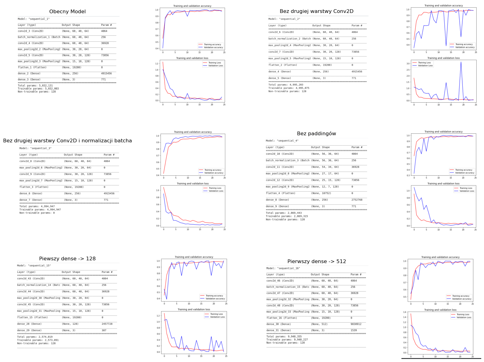

## Praktyczne zastosowanie modelu do rozpoznawiania obrazów

```python
print("Etykiety klas:")
print(train_generator.class_indices , '\n' , '\n')


image = Image.open(PATH + "/rps-cv-images/paper/04l5I8TqdzF9WDMJ.png")
image_new = image.resize((40,60))
image_array = np.array(image_new)
holder = []
holder.append(image_array)
holder = np.array(holder)
print("Papier, Wynik klasyfikacji:", '\n')
print(model.predict(holder), '\n', '\n')
image1np = mpimg.imread(PATH + "/rps-cv-images/paper/04l5I8TqdzF9WDMJ.png")

image3 = Image.open(PATH + "/rps-cv-images/rock/00nKV8oHuTGi20gq.png")
image_new3 = image3.resize((40,60))
image_array3 = np.array(image_new3)
holder3 = []
holder3.append(image_array3)
holder3 = np.array(holder3)
print("Kamień, Wynik klasyfikacji:", '\n')
print(model.predict(holder3), '\n', '\n')
image3np = mpimg.imread(PATH + "/rps-cv-images/rock/00nKV8oHuTGi20gq.png")

image2 = Image.open(PATH + "/rps-cv-images/scissors/0657zSfiTYzP2jrl.png")
image_new2 = image2.resize((40,60))
image_array2 = np.array(image_new2)
holder2 = []
holder2.append(image_array2)
holder2 = np.array(holder2)
print("Nożyce, Wynik klasyfikacji:",'\n')
print(model.predict(holder2),'\n', '\n')
image2np = mpimg.imread(PATH + "/rps-cv-images/scissors/0657zSfiTYzP2jrl.png")

pliob([image1np, image3np, image2np], 3, ['papier', 'kamień', 'nożyce'])
```

Etykiety klas:
{'paper': 0, 'rock': 1, 'scissors': 2}

    Papier, Wynik klasyfikacji:

    1/1 [==============================] - 0s 170ms/step
    [[1. 0. 0.]]


    Kamień, Wynik klasyfikacji:

    1/1 [==============================] - 0s 53ms/step
    [[0. 1. 0.]]


    Nożyce, Wynik klasyfikacji:

    1/1 [==============================] - 0s 70ms/step
    [[0. 0. 1.]]

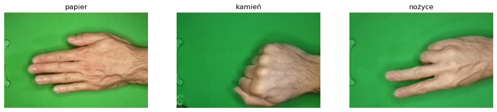

## Źródła:

- Zbiór danych:
  <https://www.kaggle.com/datasets/drgfreeman/rockpaperscissors?datasetId=107582&sortBy=voteCount>
- Kod inspiracyjny:
  <https://www.kaggle.com/code/anurag629/rockpaperscissors-accuracy-99-detailed-explanation>
- Opis działania CNN: <https://youtu.be/HGwBXDKFk9I>
- Opis ImageDataGenerator:
  <https://www.tensorflow.org/api_docs/python/tf/keras/preprocessing/image/ImageDataGenerator>
- Opis działania padding: <https://youtu.be/PGBop7Ka9AU>
- Opis normalizacji batchu (BatchNormalization):
  <https://youtu.be/yXOMHOpbon8>
- Opis ReduceLROnPlateau:
  <https://keras.io/api/callbacks/reduce_lr_on_plateau/>
- Opis funkcji straty:
  <https://gombru.github.io/2018/05/23/cross_entropy_loss/>
- Opis optymizatorów w sieci CNN:
  <https://www.youtube.com/watch?v=JhQqquVeCE0>
